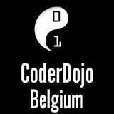

# Pagina met link

We hebben nu gezien hoe we een stukje tekst in een webpagina zetten in [mijn eerste webpagina](https://github.com/CoderDojoMechelen/mijn-eerste-webpagina) en hoe we een plaatje toevoegen in [pagina met plaatje](https://github.com/CoderDojoMechelen/pagina-met-plaatje).

Als het goed is, ziet jouw [`hallo.html`](hallo.html) er nu ongeveer zo uit.

```
<html>
    <head></head>
    <body>
        Hallo Wereld!
        
    </body>
</html>
```

## De opdracht

Laten we nu eens een pagina linken met een andere pagina. Zo kunnen we met 1 muisklik van de ene pagina naar een andere pagina springen.

## De aanpak

Eerst en vooral moeten we een tweede pagina maken waarnaar we toe kunnen linken. Laten we deze pagina [`welkom.html`](welkom.html) noemen en daar de volgende inhoud in steken.

```
<html>
    <head></head>
    <body>
         Welkom op mijn pagina
    </body>
</html>
```

Om een link te maken in onze HTML pagina, moeten we gebruik maken van de `<a></a>` tag. Deze tag heeft net als de `` tag een extra argument `href` nodig om te linken maar ook een tekst die gebruikt wordt om op te klikken.

In [`hallo.html`](hallo.html) kunnen we het volgende regeltje dan toevoegen.

```
<a href="welkom.html">Ga naar welkom</a>
```

Als we dan de hele HTML code bekijken, dan gaat onze [`hallo.html`](hallo.html) er ongeveer als volgt uitzien.

```
<html>
    <head></head>
    <body>
        Hallo Wereld!
        
        <a href="welkom.html">Ga naar welkom</a>
    </body>
</html>
```

Waneer we dan [`hallo.html`](hallo.html) openen in onze browser, dan zien we dat er een linkje is. Als we er dan op klikken komen we op [`welkom.html`](welkom.html) uit. Probeer maar.

### Wist-je-datje

Het internet dat je nu kent is niks anders dan pagina's die linken naar andere pagina's op het web. Vroeger noemden we dit het **wereldwijde web** of **www** en daarom zie je in veel links naar websites deze afkorting staan (bijv. www.coderdojobelgium.be). Vandaag de dag zijn het niet alleen meer web sites die verbonden zijn met het internet, maar ook de toepassingen op je telefoon, je televisie thuis en zelfs koelkasten of koffiezetapparaten. Maar mensen houden graag de **www** in hun web adressen ook al is het internet het **wereldwijde web** ontgroeid.

## Beetje moeilijker

Kun jij in [`welkom.html`](welkom.html) een link terug naar [`hallo.html`](hallo.html) maken?
